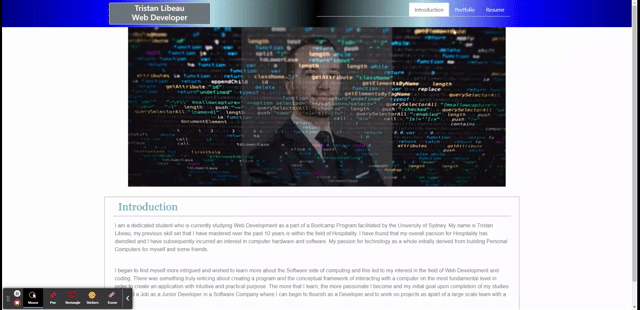

## Introduction

Portfolio:

The deployed Webpage is a simple web application to use as my web developer resume, it contain a brief introduction about myself, a portfolio with the current web application that I developed during my Bootcamp course as well as my resume and a link to dowload it.

* URL of the Web page:

https://tristanlibeau.github.io/Updated-Portfolio/

* URL of my Repository:

https://github.com/TristanLibeau/Updated-Portfolio

## Functionality:

* The working application is made of 3 differents HTML files all link to the navigation bar, clicking on the link will channge to the matching HTML. 
* The footer is also made with links to my different media such as GitHub and Linkedin, clicking on the links will open a new page on your browser to the matching pages.
* The last page will only present a link to show my resume with the posibility to dowload it.
* My personal details are present on the footer as links, that will directly contact me once you click on it.
* The web application as been using bootstrap reposive system and is working on destop, tablet and mobile.

## Mock-Up 

This is a Gif of the expected behavior.

## Credits
* w3schools.com 
* StackOverflaw 
* BootCamp Course
* Bootstrap
